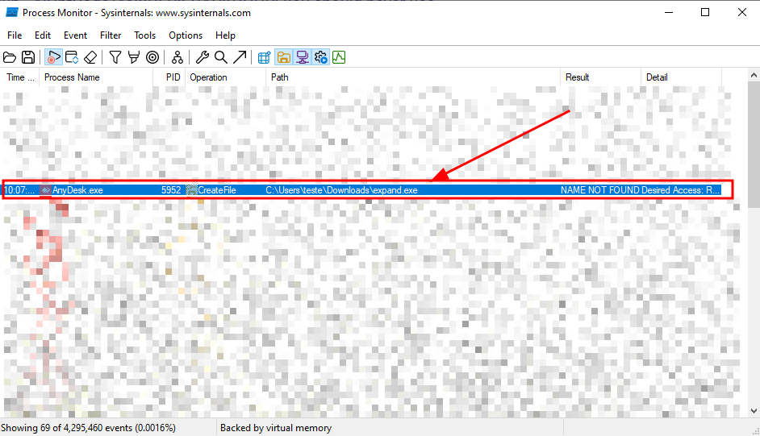
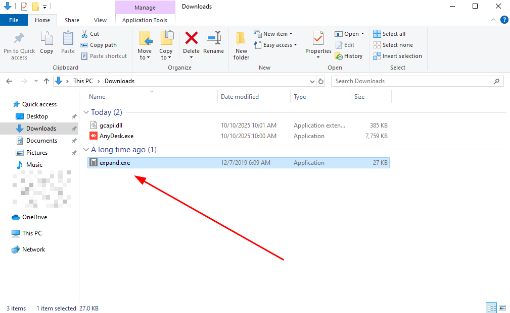
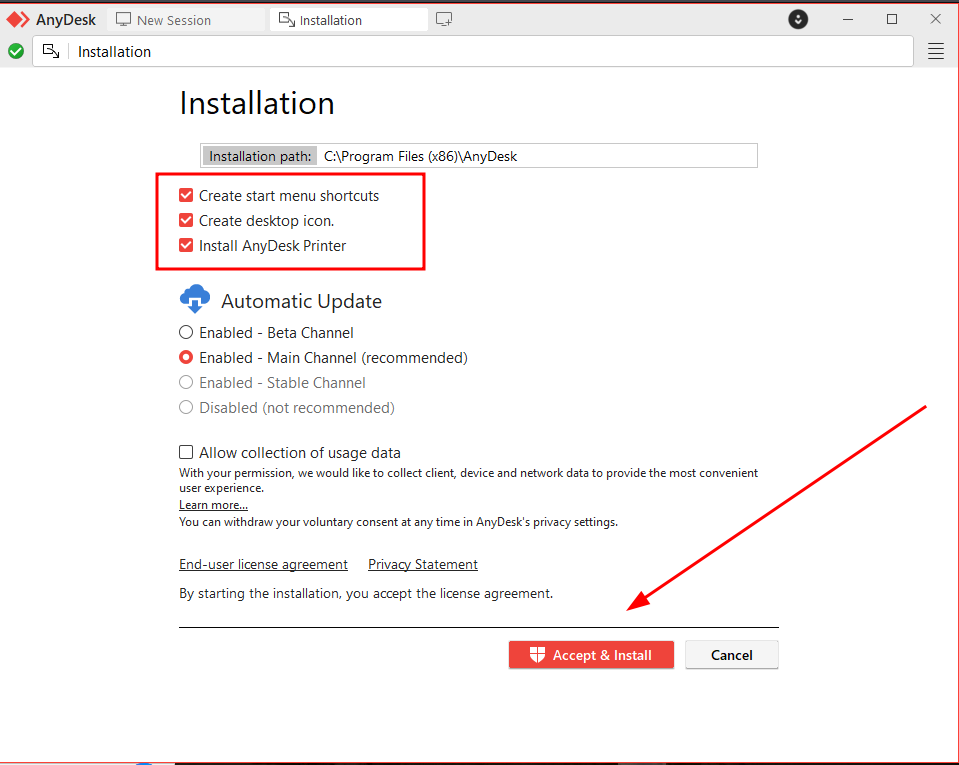
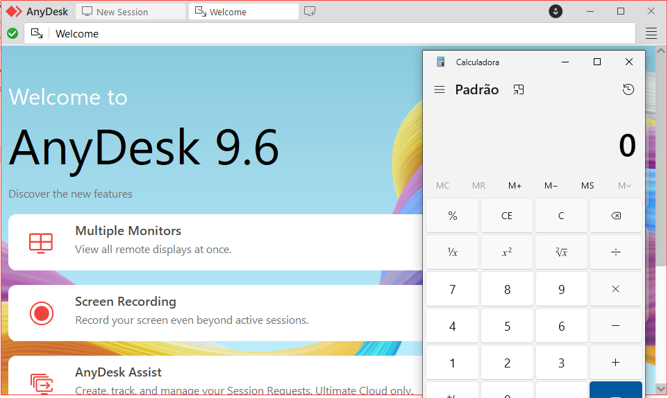

Presentation:\
Data: 20/10/2025\
Autor: David Silva

Security vulnerability: EXE Hijacking\
Affected Component:  AnyDesk version 9.6 installer for Windows\

Product: AnyDesk for Windows\
Version: 9.6\
Vendor: AnyDesk (https://anydesk.com/)

**Vulnerability Description**\
A vulnerability has been discovered affecting the 9.6 version of AnyDesk for the Windows operating system, which allows EXE hijacking through the software installer.

**Impact**\
By exploiting this vulnerability, a malicious user could send a malicious EXE file along with the legitimate installer, causing the AnyDesk installer to automatically run the malicious executable during installation, with the same privileges as the user who installed the software. This could allow an attacker to use the authentic software's credibility to execute arbitrary commands, compromise data, or alter system functionality, jeopardizing the security and integrity of the environment.

**To reproduce**:
1) Note that at the AnyDesk installation default a call is made to the folder where the installer was run looking for a missing executable with the name `expand.exe`.

2) This way, create a malicious exe file called `expand.exe` and paste it into the folder where the installer will run.

(_Note: If you have AnyDesk installed, uninstall it before continuing._)

3) Start the AnyDesk installation normally and keep the default options enabled.

4) During installation, the malicious executable will be loaded automatically.

