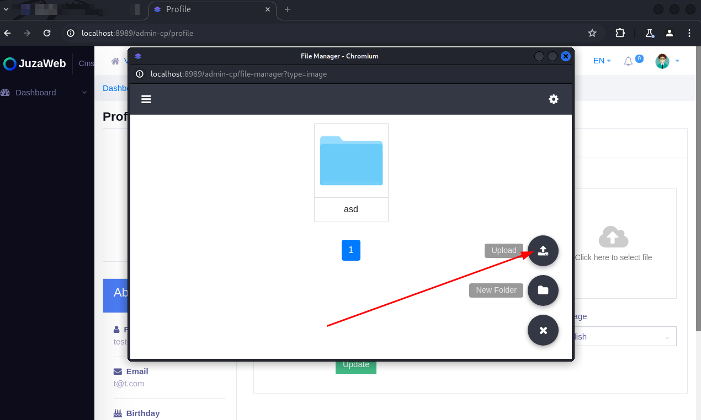
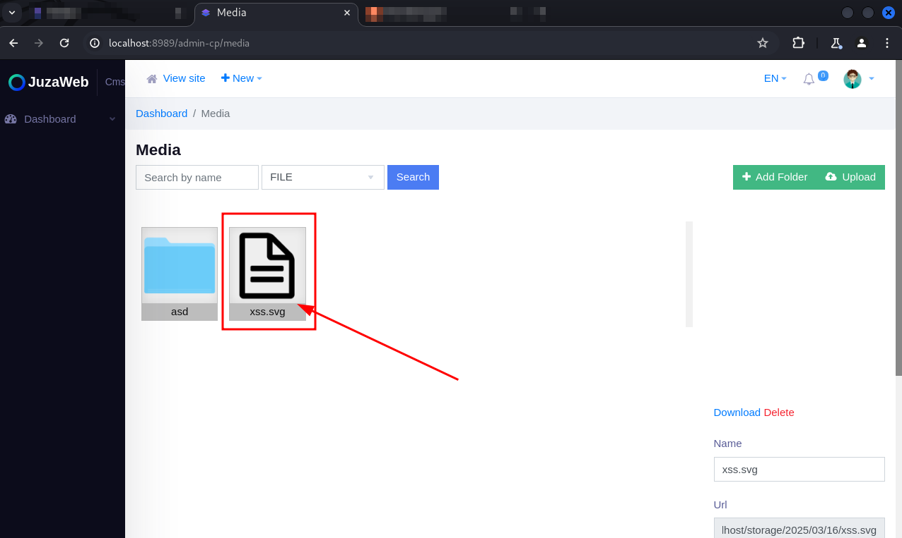

Presentation:\
Data: 18/03/2025\
Autor: David Silva

Security vulnerability: Cross-Site Scripting\
Affected Component:  The “Avatar" in profile page\
CVSS:4.0/AV:N/AC:L/AT:N/PR:L/UI:A/VC:N/VI:H/VA:N/SC:N/SI:N/SA:N

Product: Juzaweb CMS\
Version: 3.4.2\
Vendor: Juzaweb (https://juzaweb.com/)

Vulnerability Description\
This vulnerability allows an attacker with access to the profile page to upload a malicious SVG file, even with extension filters enabled.

Impact\
By exploiting this vulnerability, the attacker can execute scripts that can lead to different malicious activities, such as redirects, malware installation, among others.

To reproduce:
1) Create a new user and add it to a role with all permissions disabled;

2) Log in with that user's account;

3) Access the "Profile" page;

4) Click on the "Avatar" field and select a malicious .svg file to be uploaded;

5) Intercept the upload request with a proxy, such as Burp Suite;

6) Change the value of the "type" parameter from "image" to "file" and continue with the request;

7) Note that even if an error is returned on the front-end, the file is uploaded on the "Media" page;

8) Directly accessing the file address and the malicious payload is triggered.

