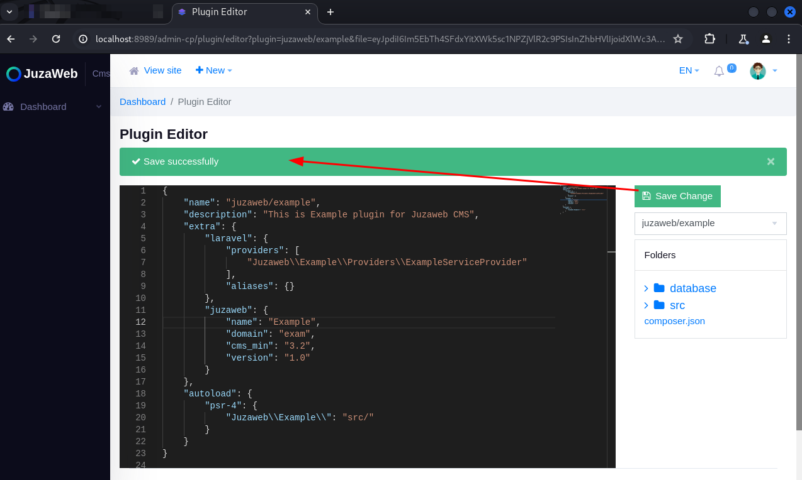

Presentation:\
Data: 18/03/2025\
Autor: David Silva

Security vulnerability: Broken Access Control\
Affected Component:  The “Plugin" page\
CVSS:4.0/AV:N/AC:L/AT:N/PR:L/UI:N/VC:H/VI:H/VA:H/SC:L/SI:H/SA:L

Product: Juzaweb CMS\
Version: 3.4.2\
Vendor: Juzaweb (https://juzaweb.com/)

Vulnerability Description\
An unprivileged user can access and edit the code of plugins installed on the CMS.

Impact\
By exploiting this vulnerability, a malicious user will be able to edit the plugins installed on the CMS, and may even perform arbitrary code execution.

To reproduce:
1) Create a new user and add it to a role with all permissions disabled;

2) Log in with this user's account;

3) Access the address http://your-application.com/admin-cp/plugin/editor;

4) Note that the user can access and edit the functions related to editing plugins:

