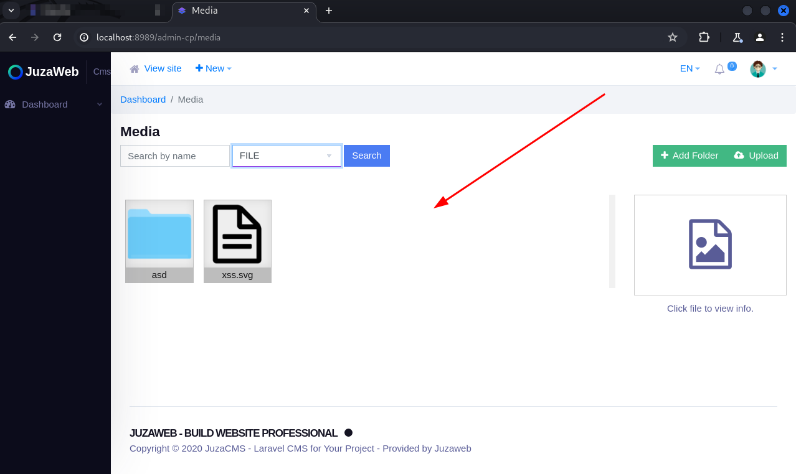
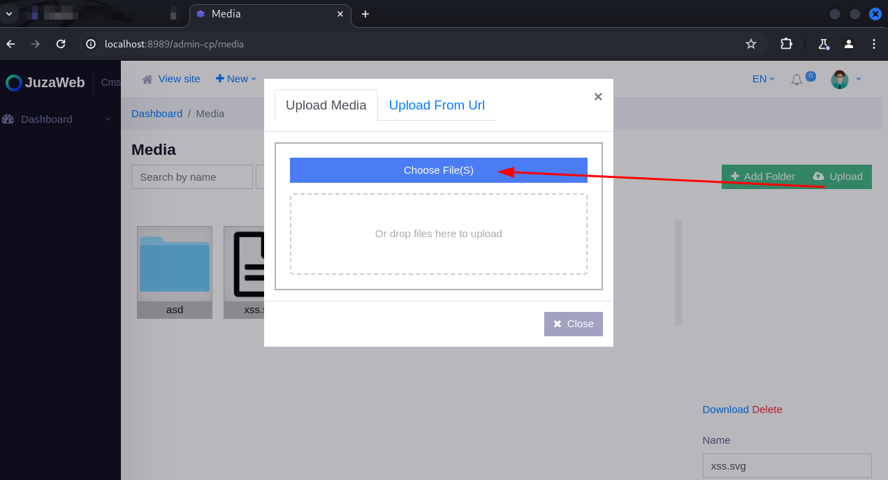
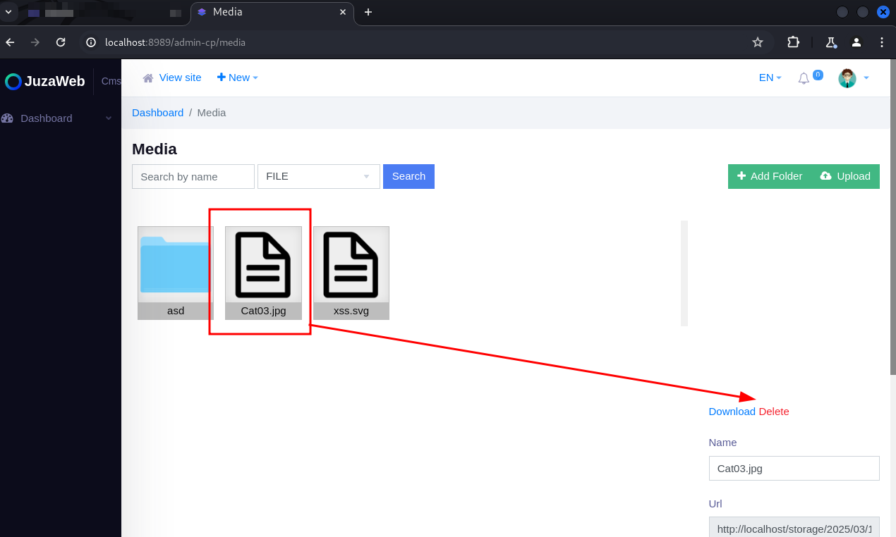
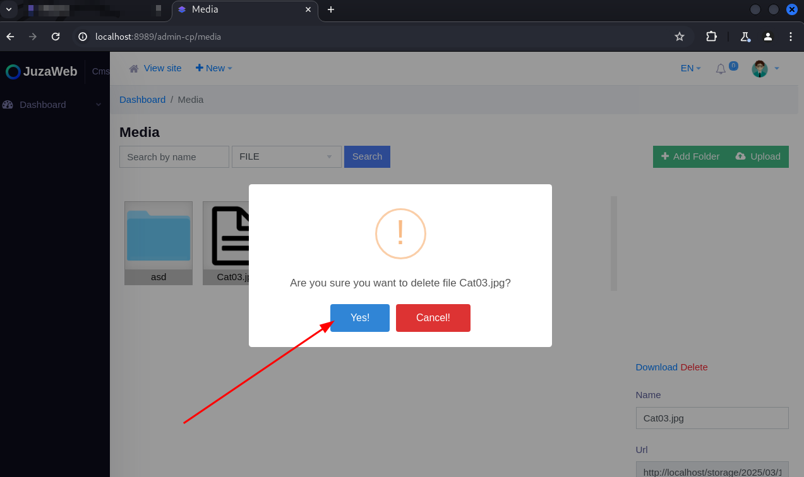
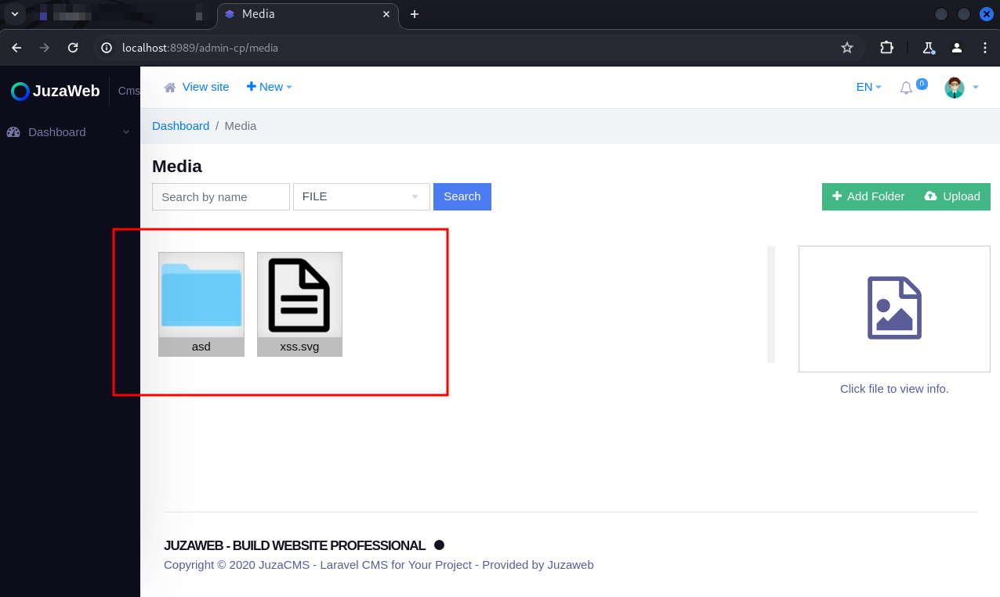

Presentation:\
Data: 18/03/2025\
Autor: David Silva

Security vulnerability: Broken Access Control\
Affected Component:  The “Media" page\
CVSS:4.0/AV:N/AC:L/AT:N/PR:L/UI:N/VC:L/VI:H/VA:N/SC:N/SI:N/SA:N

Product: Juzaweb CMS\
Version: 3.4.2\
Vendor: Juzaweb (https://juzaweb.com/)

Vulnerability Description\
An unprivileged user can access and modify the files listed on the "Midea" page.

Impact\
By exploiting this vulnerability, a malicious user can list the files uploaded to the CMS, download and delete files, as well as upload files to the application.

To reproduce:
1) Create a new user and add it to a role with all permissions disabled;

2) Log in with this user's account;

3) Access the address http://your-application.com/admin-cp/media ;

4) Note that the user can list and delete files registered in the CMS, as well as upload new files:

