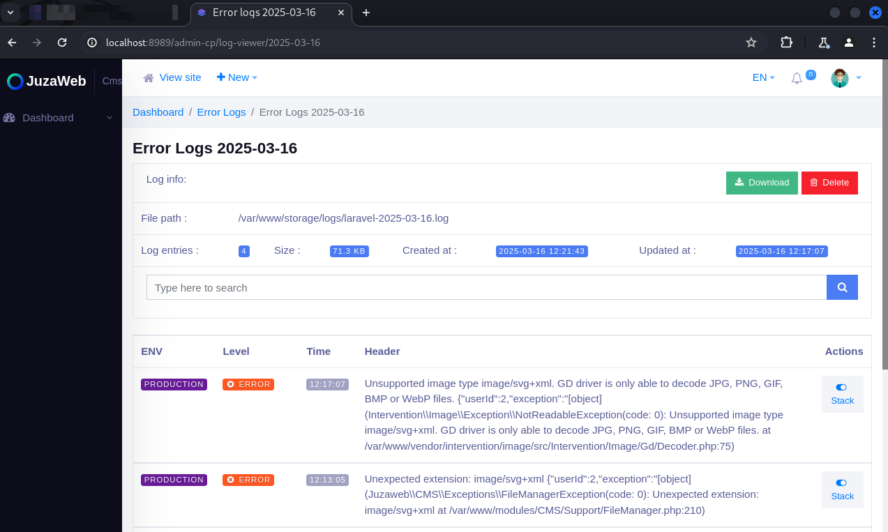

Presentation:\
Data: 18/03/2025\
Autor: David Silva

Security vulnerability: Broken Access Control\
Affected Component:  The “Error Logs" page\
CVSS:4.0/AV:N/AC:L/AT:N/PR:L/UI:N/VC:H/VI:H/VA:N/SC:N/SI:N/SA:N

Product: Juzaweb CMS\
Version: 3.4.2\
Vendor: Juzaweb (https://juzaweb.com/)

Vulnerability Description\
An unprivileged user can list and delete the logs generated by the CMS.

Impact\
By exploiting this vulnerability, a malicious user can consult the CMS error logs to better understand the general functioning of the application, as well as delete logs with the intention of hiding malicious activities.

To reproduce:
1) Create a new user and add it to a role with all permissions disabled;

2) Log in with this user's account;

3) Access the address http://your-application.com/admin-cp/log-viewer ;

4) Note that the user can access the application's error logs and deleting these logs::

