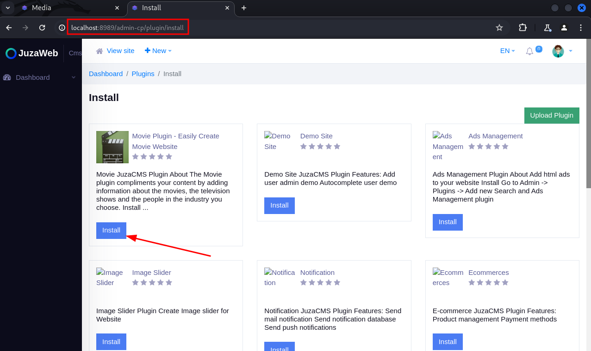
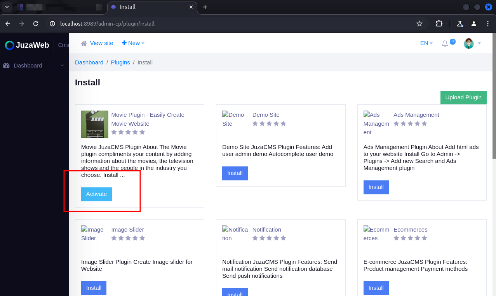

Presentation:\
Data: 18/03/2025\
Autor: David Silva

Security vulnerability: Broken Access Control\
Affected Component:  The “Plugins" page\
CVSS:4.0/AV:N/AC:L/AT:N/PR:L/UI:N/VC:L/VI:H/VA:H/SC:N/SI:N/SA:N

Product: Juzaweb CMS\
Version: 3.4.2\
Vendor: Juzaweb (https://juzaweb.com/)

Vulnerability Description\
An unprivileged user can list and install plugins in the CMS.

Impact\
By exploiting this vulnerability, an attacker can enumerate the plugins installed in the CMS, as well as install a plugin with malicious code.

To reproduce:
1) Create a new user and add it to a role with all permissions disabled;

2) Log in with that user's account;

3) Access the address http://your-application.com/admin-cp/plugin/install ;

4) Note that the user can list the installed plugins, as well as upload new plugins:

