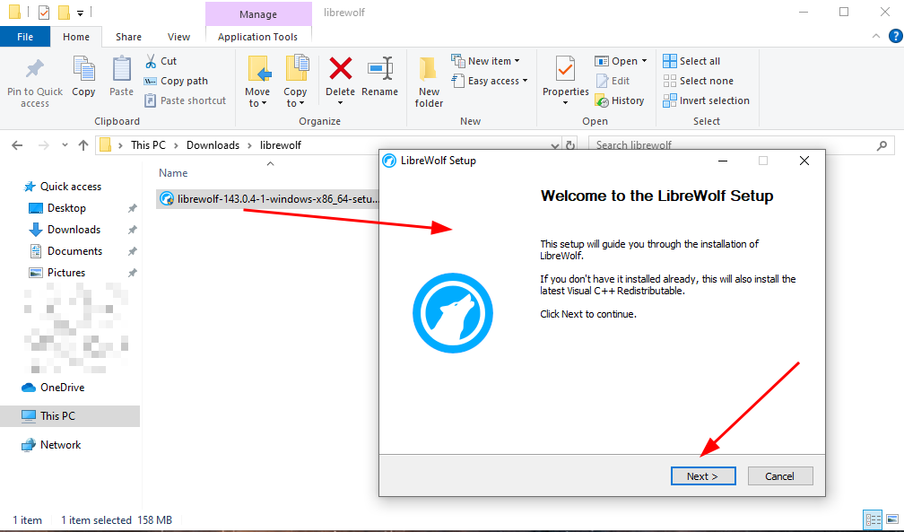
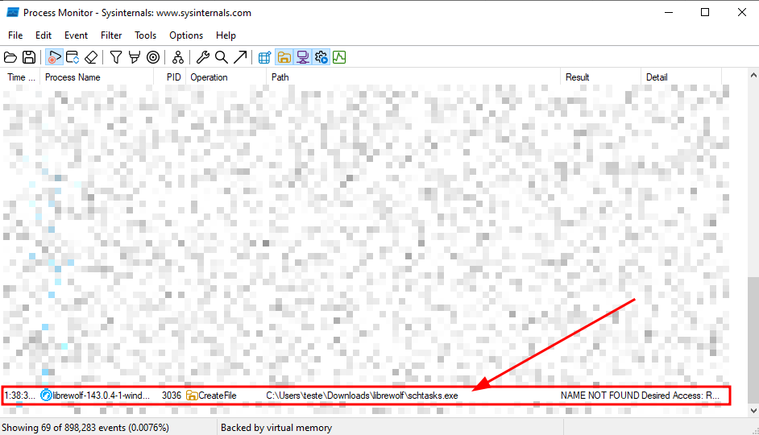
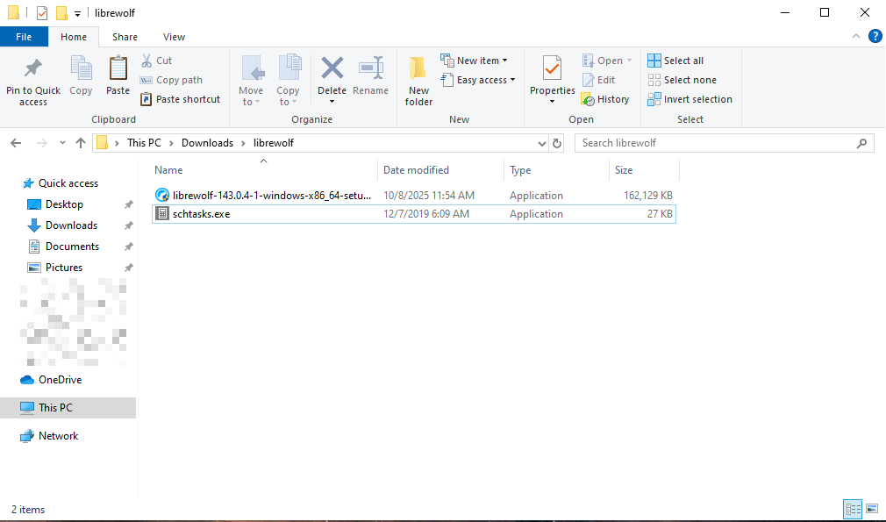
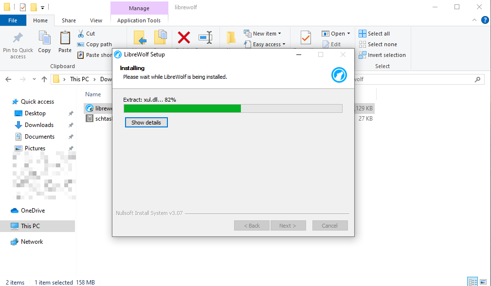
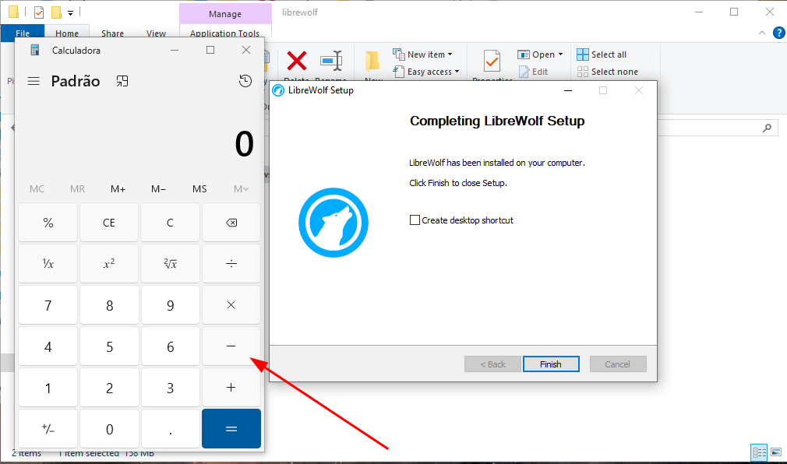

Presentation:\
Data: 08/10/2025\
Autor: David Silva

Security vulnerability: EXE Hijacking\
Affected Component:  Librewolf version 143.0.4-1 installer (librewolf-143.0.4-1-windows-x86_64-setup.exe) for Windows\

Product: LibreWolf for Windows\
Version: 143.0.4-1\
Vendor: LibreWolf (https://librewolf.net)

**Vulnerability Description**\
A vulnerability has been discovered affecting the latest version of LibreWolf for the Windows operating system, which allows EXE hijacking through the software installer.

**Impact**\
By exploiting this vulnerability, a malicious user could send a malicious EXE file along with the legitimate installer, causing the LibreWolf installer to automatically run the malicious executable at the end of the installation with the same privileges as the user who installed the browser. This could allow an attacker to use the authentic software's credibility to execute arbitrary commands, compromise data, or alter system functionality, jeopardizing the security and integrity of the environment.

**To reproduce**:
1) Note that at the end of the LibreWolf installation a call is made to the folder where the installer was run looking for a missing executable with the name "schtasks.exe".

2) This way, create a malicious exe file called "schtasks.exe" and paste it into the folder where the installer will run.

(_Note: If you have LibreWolf installed, uninstall it before continuing._)

3) Start the LibreWolf installation normally.

4) At the end of the installation, the malicious executable will be loaded automatically.

