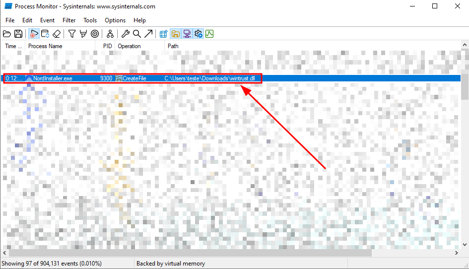
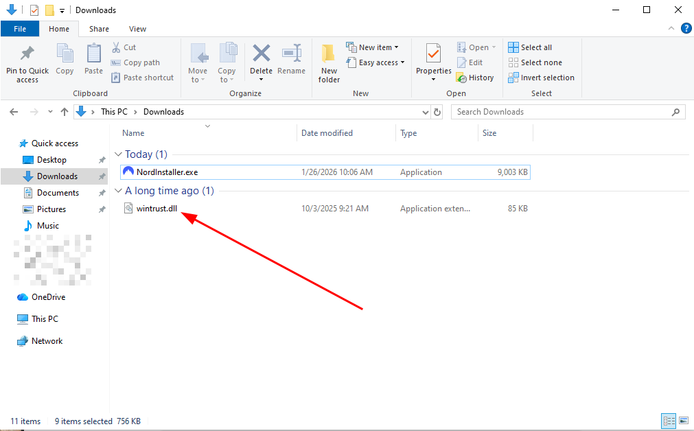
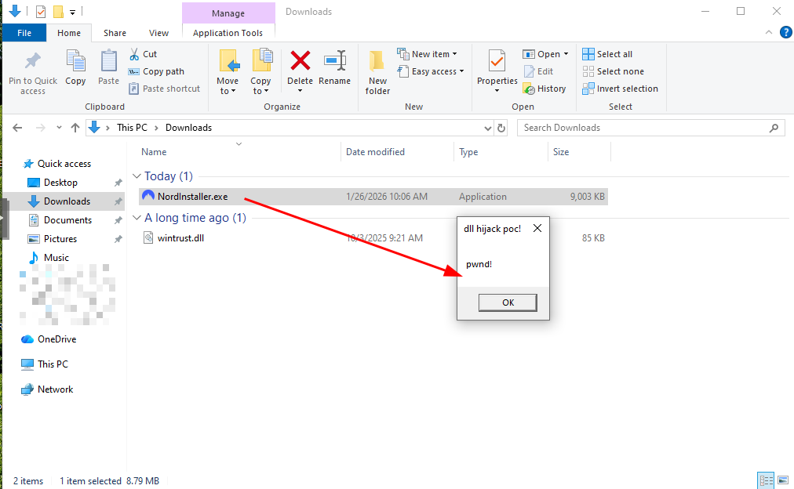

Presentation:\
Data: 27/01/2026\
Autor: David Silva

Security vulnerability: DLL Hijacking\
Affected Component:  NordVPN version 7.55 installer for Windows

Product: NordVPN\
Version: 7.55\
Vendor: NordVPN (https://nordvpn.com)

**Vulnerability Description**\
A vulnerability has been discovered affecting the latest version of NordVPN for the Windows operating system, which allows DLL hijacking through the software installer.

**Impact**\
By exploiting this vulnerability, a malicious user could send a malicious DLL file along with the legitimate installer, causing the NordVPN installer to automatically run the malicious code at the beginning of the installation with the same privileges as the user who installed the software. This could allow an attacker to use the authentic software's credibility to execute arbitrary commands, compromise data, or alter system functionality, jeopardizing the security and integrity of the environment.

**To reproduce**:
1) Note that at the beginning of the NordVPN installation, a call is made to the folder where the installer was run, searching for a missing DLL file named "wintrust.dll".

2) This way, create a malicious dll file called "wintrust.dll" and paste it into the folder where the installer will run.

3) Start the NordVPN installation normally.

4) At the beginning of the installation, the malicious dll will be loaded automatically.

