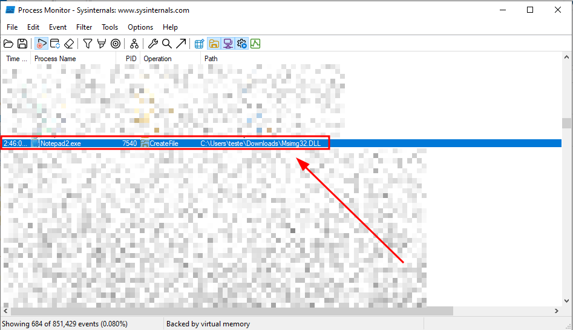
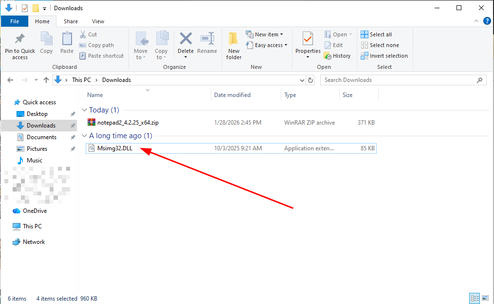
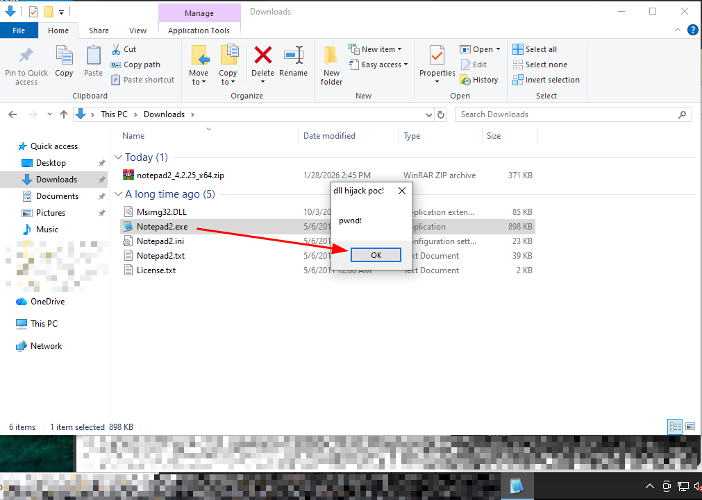

Presentation:\
Data: 30/01/2026\
Autor: David Silva

Security vulnerability: DLL Hijacking\
Affected Component:  Notepad2

Product: Notepad2\
Version: 4.2.25\
Vendor: flo's freeware (https://www.flos-freeware.ch/)

**Vulnerability Description**\
A vulnerability has been discovered affecting Notepad2, allowing DLL hijacking upon software startup.

**Impact**\
By exploiting this vulnerability, a malicious user could send a malicious DLL file along with legitimate software, causing Notepad2 to automatically execute the malicious code with the same privileges as the user who installed the software. This could allow an attacker to use the credibility of the authentic software to execute arbitrary commands, compromise data, or alter system functionality, jeopardizing the security and integrity of the environment.

**To reproduce**:
1) Note that when Notepad2 starts, it calls the folder where the software was run, searching for a missing DLL file called "Msimg32.dll".

2) This way, create a malicious exe file called "Msimg32.dll" and paste it into the folder where the software will run.

3) Start the Notepad2 normally.

4) The malicious DLL will be loaded automatically.

